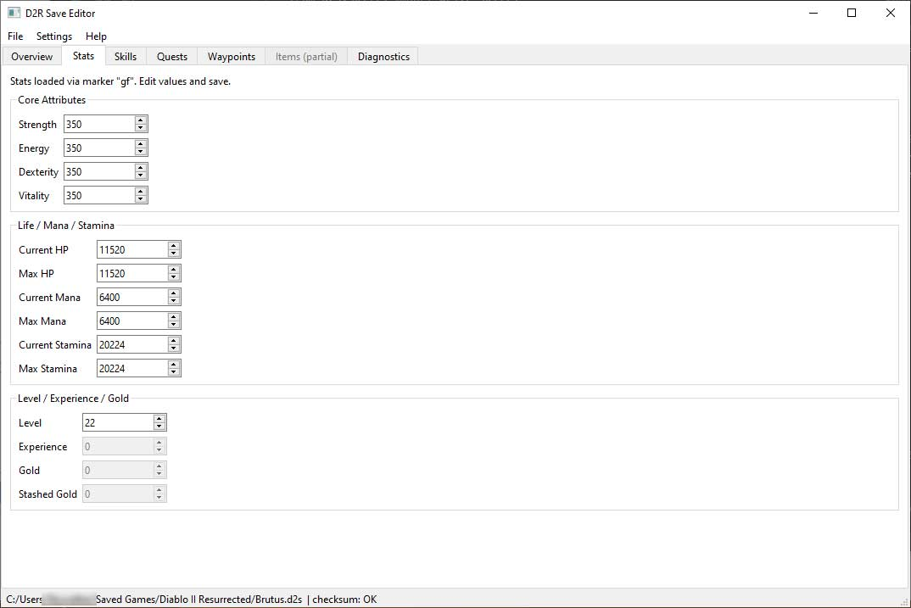

# Diablo II: Resurrected – Infernal Edition Save Game Editor

**D2R Save Editor** is an open-source **Diablo II: Resurrected – Infernal Edition** character save file editor for PC. 
Edit your D2R `.d2s` save files offline—change character: 
* name,
* level,
* stats,
* skills,
* quests,
* and waypoints.

  
Items are a work in progress.

> ⚠️ Use at your own risk. Always keep backups. This tool is intended for **offline** saves only.

## Screenshot



## Features

- **Open .d2s files** — Load and display Diablo II Resurrected character save files (signature, version, size, checksum, name, class, level)
- **Edit character** — Modify character name, level, stats (Strength, Dexterity, Vitality, Energy, Life, Mana, Gold, Experience), skills, quests, and waypoints
- **Save / Save As** — Updates file size and checksum automatically; creates `.bak` backups on overwrite
- **Generate new character** — Create a new D2R character save file from a blank template
- **Keyboard shortcuts** — Ctrl+S (Save), Ctrl+Shift+S (Save As)

## Install

```bash
pip install PyQt6
```

## Run

```bash
python launcher.py
```

Or:

```bash
python -m app.main
```

## Format references

- krisives/d2s-format (header, checksum): https://github.com/krisives/d2s-format
- Trevin v1.09 format notes (markers): https://user.xmission.com/~trevin/DiabloIIv1.09_File_Format.shtml

## Important limitations

- Items parsing is **incomplete** and disabled in this version.
- Quest bits beyond "completed" and the Prison of Ice special bit are preserved, but not interpreted.

